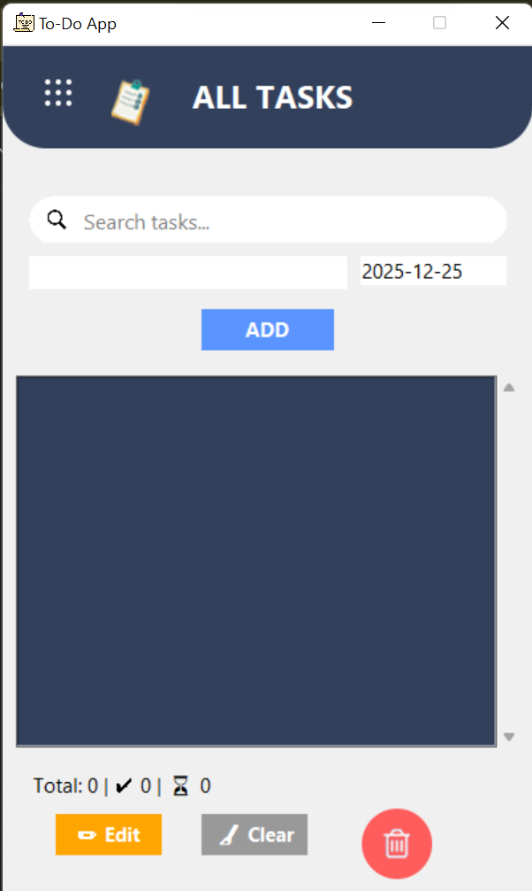
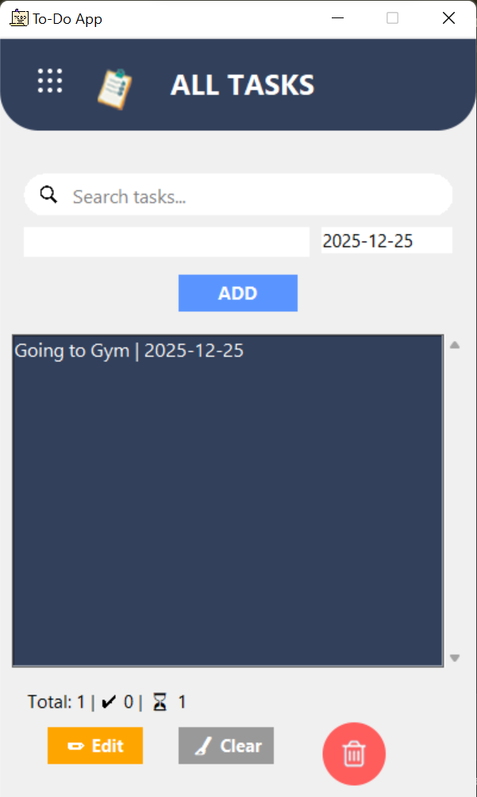
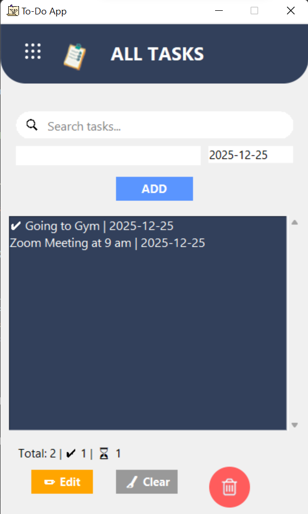
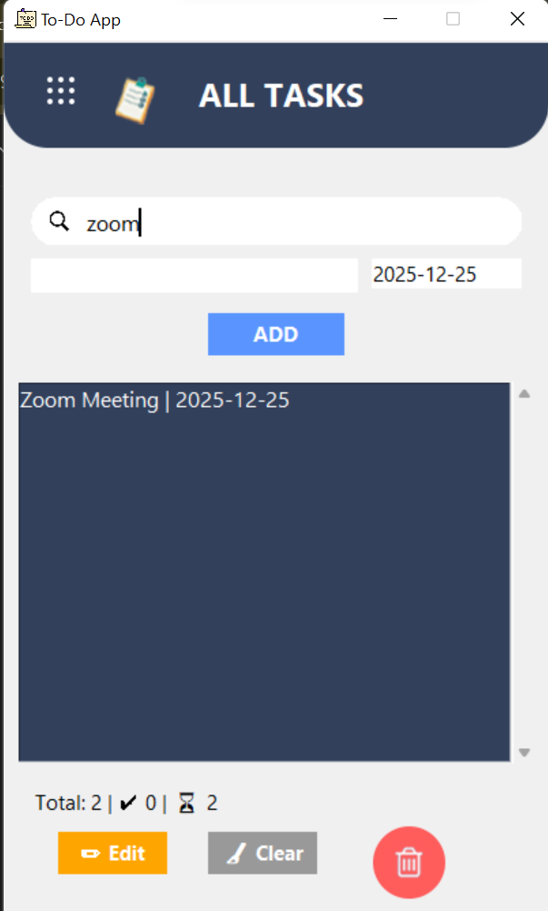

# 📝 To-Do App (Python Tkinter)

A simple and clean To-Do application built using Python and Tkinter.

## 🚀 Features
- Add, edit, delete tasks
- Mark tasks as completed
- Due dates support
- Task counter (total / completed / pending)
- Search tasks
- JSON-based persistent storage
- Clean UI with icons

## 🛠 Technologies Used
- Python
- Tkinter
- JSON

## ▶ How to Run
```bash
python app.py


## 📸 Screenshots

### Home Screen


### Add Task


### Completed Task


### Search Feature



